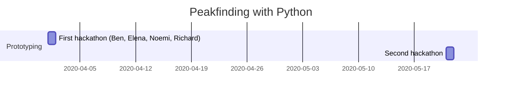

Dials peakfinding
===
[](https://diamondlightsource.slack.com/archives/C01RQJX3KU5)

## Table of Contents

[TOC]


Graeme's description of algorithm
---
*Spot Finding*
Input:
* image array i[k,j,i]
* mask array m[j,i] - value 1 for good pixel, 0 for bad

Intermediate:
* signal array s[k,j,i]

Output:
* spot bounding boxes
* spot shoeboxes:
    * image data array
    * mask data array
* spot centroid (z,y,x, pixels)
* spot centroid variances (dz, dy, dx pixels²)
* spot intensity (counts)
* spot intensity variance (counts²)

for each image i[k,:,:]:
1. set masked pixel values to 0 i.e. image *= mask
2. compute summed area table for mask i.e. as a count of useful pixels in region
3. compute summed area table from masked image, masked image squared
4. compute local mean, using kernel of +/- 3 pixels in both directions, using N for mean from mask SAT
5. compute local variance, using kernel of +/- 3 pixels in both directions, using N for mean from mask SAT
6. compute dispersion index i.e. variance / mean - for shot noise should be ~ 1
7. threshold dispersion index to find signal pixels -> s[k,:,:] = thresholded image as:
    a. 0 == not signal
    b. 1 == signal
    
then:
1. find connected regions in 3D if rotation data, 2D if grid scan data with connectivity matrix as either a 3D or 2D + shape (i.e. 3 x 3 [x 3] matrix with corner pixels 0, non corner pixels 1)
2. find bounding boxes for these connected regions
3. extract pixel data for shoeboxes, mask
4. compute centroids, variances, intensity etc. 
5. create message pack file containing this information


Data used
---
`/dls/science/groups/scisoft/DIALS/dials_data/vmxi_thaumatin/image_15799.nxs`

get it with:
`dials.data get vmxi_thaumatin`

run with:
`python threshold.py <path to data>/vmxi_thaumatin/image_15799.nxs`

Aproaches
---

### 1. `OpenCV`

* a few lines to find highest intensity regions in an image
* however, OpenCV images are arrays with int intensity values. From what we could tell it would couse loose of information for this application.  
* Elena might take another look at this. 


---
### 2. naive dispersion index approach using `scipy.ndimage.convolve`

```python=
def scipy_convolve_disp_index(image, kernel_size):
    masked_image = image * mask
    masked_image2 = masked_image**2

    sum_image = ndimage.convolve(masked_image, kernel, mode="constant", cval=0)
    sum_sq = ndimage.convolve(masked_image2, kernel, mode="constant", cval=0)
    n = ndimage.convolve(mask, kernel, mode="constant", cval=0)

    mean_image = np.zeros_like(masked_image, dtype=np.float)  
    np.divide(sum_image, n, where=(n > 0), out=mean_image)

    inv_count = np.zeros_like(image, dtype=np.float)
    np.divide(1, n, where=(n > 0), out=inv_count)

    variance_image = (sum_sq - inv_count * sum_image ** 2) * inv_count

    dispersion_index = np.zeros_like(masked_image, dtype=np.float)
    np.divide(variance_image, mean_image, where=(mean_image > 0), out=dispersion_index)
    return dispersion_index
```

This turned out to be quite slow. convolutions are more expensive thans sums 


---
### 3 python loops for SAT

```python=
def sat_python(image):
    '''
    SAT with explicit loops
    '''
    sat = np.zeros_like(image)
    for i in range(image.shape[0]):
        for j in range(image.shape[1]):
            sat[i, j] = image[i, j] + sat[i, j - 1] + sat[i - 1, j] - sat[i - 1, j - 1]
    return sat
```

---
### 4 `np.cumsum` for SAT

```python=
def sat_numpy(image):
    '''
    SAT is a double cumsum
    '''
    sat = np.empty_like(image)
    image.cumsum(axis=0, out=sat).cumsum(axis=1, out=sat)
    return sat
```

*Notes*: 
1. `out` option allows in-place modification. 
2. It is unfortunate that, while `numba` supports `np.cumsum` in `nopython` mode, it does not support the `axis` option.

---
### 5 python loops + numba for SAT

```python=
@numba.njit(numba.int32[:, ::1](numba.int32[:, ::1]))
def sat_python_numba(image):
    '''
    SAT with explicit loops helped by numba
    '''
    sat = np.zeros_like(image)
    for i in range(image.shape[0]):
        for j in range(image.shape[1]):
            sat[i, j] = image[i, j] + sat[i, j - 1] + sat[i - 1, j] - sat[i - 1, j - 1]
    return sat
```

___
### 7 `np.divide` for variance
```python=
inv_count = np.divide(1, n, where=(n > 0))
variance_image = (sum_sq - inv_count * np.square(sum_image)) * inv_count
```

___
### 8 `numba` for variance
```python=
@numba.njit(error_model="python")
def variance(sum_image, sum_image_sq, n):
    return (sum_image_sq - np.square(sum_image) / n) / n
```

Using `numba` instrad of `np.divide` reduced time by a third.

Lessons
---

* Starting with an `int` image means operations like `divide` will force casting, which for large arrays can be observable overhead. Explicitely initialising outputs to float  (like we did for `divide` and `cumsum`) could help. However, it is worth testing case by case. 
* `np.divide` was has a nice way to deal with division by zero. However, `numba` handles division by zero silently and it is faster. We ended up separeting out 

Speeds
---

`timeit` results from the jupyter notebook on Elena's PC. 

| Approach num.  |  2. | 3. + 7.| 4. + 7. | 5. + 6. | 5. + 7.
| -------------- | ----|--------|---------|-------|----
| Speed (ms/loop)| 550 | 10800   | 140    | 150   |105


Project Timeline
---



###### tags: `Python` `Numpy` `Peakfinding`
